# 🔐 Personal PowerShell Password Vault

<!-- Modern Status Badges -->
[](https://learn.microsoft.com/en-us/powershell/)
[](https://www.microsoft.com/windows)
[](#-architecture--security-model)

A lightweight, high-security, local CLI-based password manager built natively using PowerShell and the Windows .NET Cryptography ecosystem. It features **zero external dependencies**, a **dual-layer cryptographic architecture**, and **automatic operating-system-level folder hardening**.



---

## 🏗️ Architecture & Security Model

This vault implements a rigorous security footprint entirely isolated to your local environment. **Your passwords are never transmitted over a network or stored in plain text.**

### 🔑 1. The Cryptographic Blueprint
The database utilizes a **dual-layer protection model** to safeguard your data:

* **Inner Cryptographic Layer (_Master Password Bound_):** Your database custom objects are serialized to standard JSON text and encrypted using **AES-256** encryption. The structural key is derived using **PBKDF2** (`Rfc2898DeriveBytes`) with **200,000 hash iterations** using **SHA256** and an un-reused **32-byte cryptographically secure random salt**.
* **Outer Cryptographic Layer (_Windows DPAPI Bound_):** The encrypted wrapper and its associated Key Derivation Function (KDF) metadata parameters are systematically protected utilizing the **Windows Data Protection API (DPAPI)**. This algorithm binds the final physical file output to your specific Windows User Security Identifier (SID). Even if malicious parties extract your database file, it cannot be unpacked on another system or Windows account without your explicit platform profile security context.

### 🛡️ 2. NTFS Privilege Hardening
Upon initial boot, the environment intercepts the storage path and hardens its access metrics via native Windows Access Control Lists (`icacls.exe`). It strips down inherited directory permissions and establishes exclusive access parameters to only:

1. **The Explicit Current User SID** *(Full Control)*
2. **The Local SYSTEM Account** *(Full Control)*
3. **The Built-In Windows Administrators Group** *(Full Control)*

---

## ✨ Features Checklist

- [x] **Zero-Dependency Core:** Runs entirely out-of-the-box on standard Windows operating systems using native components.
- [x] **Dual-Layer Local Encryption:** Combines user-authenticated master key derivation with hardware-linked account access via DPAPI.
- [x] **Automatic Environment Generation:** Dynamically spins up directories and provisions secure structural objects during first boot.
- [x] **Permission Hardening:** Automated OS-level validation blocks other standard desktop user accounts from peering into the data folder.
- [x] **Non-Destructive Smart Input Editing:** Pass empty strings (`Enter`) during adjustments to preserve original variables without re-entry.
- [x] **Asynchronous Clipboard Isolation:** Volatile string copy operations execute background threads (`Start-Job`) to clear data footprints after **15 seconds** with identity checks.
- [x] **Collision Validation:** Blocks identical entries automatically through case-insensitive text validations.

---

## 📂 Repository Structure

The layout separates configuration endpoints from baseline logic assets to ensure clear discoverability:

```text
MyPasswordVault/
│
├── run-vault.bat          # The main launcher entry point (Double-Click)
│
├── src/                   # Source directory housing primary system scripts
│   └── vault.ps1          # Master script engine containing CRUD and Crypto subroutines
│
├── data/                  # [Auto-Generated] Secure local container
│   └── vault.enc          # [Auto-Generated] Secure dual-encrypted database file
│
├── .gitignore             # Essential Git protocol file preventing local vault tracking
└── README.md              # Project documentation handbook
```

---

## 🚀 Quick Start Guide

### Step 1: Clone or Download the Workspace

Clone this repository directly into your local development environment via a command line console:

```bash
git clone [https://github.com/YOUR-USERNAME/MyPasswordVault.git](https://github.com/YOUR-USERNAME/MyPasswordVault.git)
```

> 💡 *Alternatively, choose **Download ZIP** from the GitHub UI and extract it to a secure location of your choice.*

### Step 2: Establish Your Git Protections

To ensure your personal passwords are never tracked, verified, or accidentally published online, look at or append the root `.gitignore` file:

```text
# Ignore local secure data binaries
data/
*.enc
```

### Step 3: Run the Vault Launchpad

Navigate into your project folder directory and execute the main controller file:

* Double-click **`run-vault.bat`** in Windows Explorer.
* **Or** call it directly from a PowerShell/CMD terminal window:
```powershell
  .\run-vault.bat
  ```

> [!IMPORTANT]
> **First-Time Initialization Note:** On its very first execution loop, the application detects that no file is present, outputs a yellow notice prompt, and guides you through setting up a unique **Master Password**. Keep this safe; if lost, the local cryptographic assets cannot be retrieved.

---

## 🛠️ Code Deep Dive & Operational Architecture

The core runtime uses native Windows API hooks and .NET frameworks to complete tasks securely:

| Section Module | Logic Subroutine Name | Mechanics Description |
| :--- | :--- | :--- |
| **System Security** | `Protect-VaultStorage` | Calls `icacls.exe` with parameters `/inheritance:r` to isolate local user footprints from visibility leakages. |
| **Memory Isolation** | `ConvertTo-PlainText` | Leverages `SecureStringToBSTR` and `ZeroFreeBSTR` marshaling models to minimize plaintext leaks in system memory. |
| **Clipboard Defense**| `Copy-TextToClipboard` | Drops sensitive tokens onto the clipboard stack and spins up a timed `Start-Job` task block to invalidate state parameters safely. |
| **Data Continuity** | `Edit-VaultEntry` | Implements fallback validations (`[string]::IsNullOrWhiteSpace`) to safely permit non-destructive field retention. |

---

## 🔒 Requirements & Execution Constraints

* **Operating System:** Windows 10 or Windows 11 desktop environments.
* **Shell Engine:** Windows PowerShell 5.1 (or alternative PowerShell Core environments).
* **Execution Privileges:** Standard User Context *(the script handles your localized profile SID directly without requiring elevated Administrator windows).*
